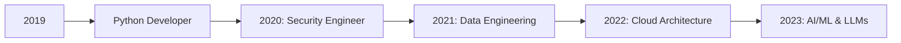

# 👋 Hey there, I'm Surya Teja Koka

  

  

---

### 🔍 About Me

- 💻 **Security Engineer & Data Engineer** at ConcertoCard | TuringIQ
- 🧠 Building scalable **fraud models** & developing **secure APIs**
- 🛡️ PCI-DSS | OWASP | SIEM | Vulnerability Management
- 🧰 Python | FastAPI | Django | SQL | DBT | Dagster | Pydantic | OpenTelemetry
- ☁️ AWS Developer Associate | Infrastructure & Cloud Ops
- 👨‍🏫 Taught **6,000+ students** on Udemy + college bootcamps  
- 🧪 Passionate about **AI/LLMs, FinOps, and prompt engineering**

---

### 🛠️ Tech Stack

**Languages & Frameworks**  
  
  
  
  
  
  

**DevOps & Cloud**  
  
  
  
  
  

**Data Engineering**  
  
  
  
  
  

**Security & Monitoring**  
  
  
  
  
  

---

### 🔭 Current Work

- 🚨 Developing RuPay Fraud Model (PCA, ICA, RFE, entropy logic)
- 📊 Analyzing red flag indicators & transaction trends at scale
- 🔄 Optimizing async APIs using FastAPI & telemetry instrumentation
- 🏗️ Building orchestration pipelines with Dagster for model retraining
- 🌐 Handling full-stack PCI compliance + internal penetration testing

---

### 🚀 Current Engagements

#### 🧠 TuringIQ

At [TuringIQ](https://turingiq.ai/), we empower businesses by guiding them through the intricate terrain of AI adoption, unlocking new opportunities and fostering growth. Our team of experts, with backgrounds at tech giants like Google and PayPal, provides tailored AI solutions to expedite our clients' AI journey, leading to significant advancements in their business operations.

#### ✈️ Nalaland

I'm also contributing to the [Nalaland](https://www.nalaland.in/), officially known as the "Nalaland: Unforgettable Camping Adventures." Explore unique camping sites, luxurious resorts, and thrilling adventure parks with our curated collection of wilderness experiences.

#### 🌊 Lakeshore LLC
I'm engaged with Lakeshore LLC, a U.S.-based company, as a passive contributor and consultant on various projects. Additionally, I am the developer of their official site: [LakeshoreLLC](https://www.lakeshoreitllc.com/.)

---

### 📚 Featured Projects

#### 🔒 Security & Compliance
- [PCI-DSS compliance guide](#) *(coming soon)*
- [PII-Hunter](https://github.com/SuryaTeja-koka/PII-HUNTER) - Automated PII detection and classification tool
- [Secure API Framework](https://github.com/SuryaTeja-koka/secure-api-framework) - Production-ready FastAPI security templates

#### 🤖 Automation
- [WhatsApp Automation](https://github.com/SuryaTeja-koka/WhatsAppAutomation_GSuite) - Automated WhatsApp messaging system integrated with Google Suite

#### 🎓 Education
- [Python for Security Engineers](https://www.udemy.com/course/python-for-security-engineers/) - Comprehensive security automation course
- [FastAPI Masterclass](https://www.udemy.com/course/fastapi-masterclass/) - Building secure and scalable APIs

#### 🌐 Web Development
- [Columbuscoffeehouse](https://www.columbuscoffeehouse.com/) - Modern e-commerce platform
- [Portfolio Website](https://suryateja-koka.github.io/portfolio/) - Personal portfolio showcasing projects

---

### 📈 Learning Journey

---

### 🌐 Portfolio & Social

🔗 [Visit My Portfolio](https://suryateja-koka.github.io/portfolio/)

  
  
  
  

📫 **Email**: tejasurya274@gmail.com  
📆 **Calendar**: [Book a Call with Me](https://cal.com/surya-teja-k)  

---

### 📊 GitHub Activity

  

---

_"Engineer with code. Secure with intent. Teach with heart."_

  

 